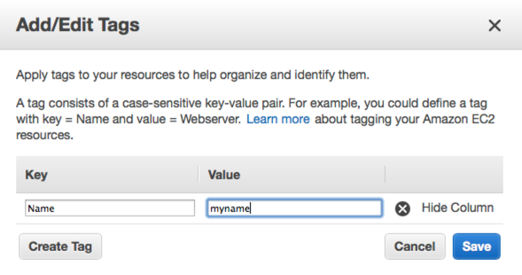

# Fogrunner - Amazon AWS CLI

Initially started as a little side and test project for managing our own AWS EC2 instances, domains and snapshots.
Got more features as we went along and implemented some higher level features compared to the AWS CLI. fogrunner is used in our AWS production environments since 2013.

fogrunner uses the awesome fog library to access AWS. It might also be a good example or starting point for the use of fog.

## Features

* simple use via command line
* uses ENV or ~/.aws/config for AWS credentials
* handles multiple AWS regions
* lists detailed status of all your EC2 instances
* lists names und region of your S3 buckets
* lists all AWS regions
* scales your running EC2 instance with just one command (stops, sets new instance type, starts, allocates elastic IP)
* lists all Route53 DNS records, filter zones by regex
* bulk assign new A record IP in Route53
* lists snapshots for each instance
* bulk deletes snapshots, uses two different methods for keeping snapshot history
* debug mode

## Installation

Clone or fork the git repository and do a 

````
$ bundle install
````

if you are using bundler to resolve the gem dependencies.

### AWS Credentials

fogrunner gets your AWS credentials via environment variables or a config file.

#### ENV

```` ruby
ENV['AWS_ACCESS_KEY']
ENV['AWS_SECRET_KEY']
````

#### config file

fogrunner uses the same config file as the AWI CLI. The config file is located in `~/.aws/config`.

````
[default]
aws_access_key_id=XXXXX
aws_secret_access_key=XXXXX
region=eu-west-1

[other profile]
aws_access_key_id=XXXXX
aws_secret_access_key=XXXXX
region=eu-west-1
````

You may specify a config section via `--profile` option:

````
$ bundle exec ruby fogrunner.rb --config 'other profile' status
````

## Commands and options

Calling via bundler

````
$ bundle exec ruby fogrunner.rb --help
Fogrunner - AWS Simple CLI
(AWS credentials via environment variables AWS_*_KEY or ~/.aws/config)

Usage:
    fogrunner [global options] [command] [command options]

where [command] is one of:
        status: Show EC2 status
        s3status: Show S3 status
        scale: Scale EC2 instance, set new instance type
        regions: Show all regions
        dns: Show DNS records
        snapshots: Show/delete snapshots

where [options] are:
       --debug, -d:   Verbose output
  --region, -r <s>:   Set AWS regions (default: eu-west-1 us-east-1 ap-southeast-1 ap-northeast-1)
 --profile, -p <s>:   Set config section from ~/.aws/config (default: default)
      --dryrun, -y:   Mock & simulate
     --version, -v:   Print version and exit
        --help, -h:   Show this message
````

Use `--help` for each command for additional command options:

````
$ bundle exec ruby fogrunner.rb scale --help
````

Example for `status` command:

````
$ bundle exec ruby fogrunner.rb status
7 servers in region eu-west-1
i-XXXXXXXX nameA    : stopped t1.micro   eu-west-1b     
i-XXXXXXXX nameB    : stopped t1.micro   eu-west-1c     
i-XXXXXXXX nameC    : stopped c1.xlarge  eu-west-1c     
i-XXXXXXXX nameD    : running m1.xlarge  eu-west-1c      DNS/IP: XXXXXXXX.eu-west-1.compute.amazonaws.com (A.B.C.D)
i-XXXXXXXX nameE    : stopped t1.micro   eu-west-1b     
i-XXXXXXXX nameF    : running m3.large   eu-west-1a      DNS/IP: XXXXXXXX.eu-west-1.compute.amazonaws.com (A.B.C.D)
i-XXXXXXXX nameG    : running m1.small   eu-west-1b      DNS/IP: XXXXXXXX.eu-west-1.compute.amazonaws.com (A.B.C.D)
2 servers in region us-east-1
i-XXXXXXXX nameH    : running m1.small   us-east-1e      DNS/IP: XXXXXXXX.compute-1.amazonaws.com (A.B.C.D)
i-XXXXXXXX nameI    : stopped m1.medium  us-east-1a     
0 servers in region ap-southeast-1
0 servers in region ap-northeast-1
```

## Instance Name Tag

Instance names are so much better to deal with than instance ids. So fogrunner uses a "Name" tag to find instances by name and to assiciate snapshots. The name should be unique.

There are multiple methods to set the name tag. One way is the AWS console:



## Snapshots

We use Eric Hammonds great consistent-snapshot script with xfs filesystems on all our instances. We are running a simple cron job for taking daily snapshots:

````
HOST=`hostname`
sudo ec2-consistent-snapshot --region <region> --mysql --freeze-filesystem <mountpoint> <volumename> --mysql-username <mysqluser> --mysql-password <mysqlpassword> --description "ec2_consistent_snapshot($HOST)"
````

It is important to include the hostname in the snapshot description. fogrunner uses the hostname to associate a snapshot with an EC2 instance. 
You don't have to use consistent-snapshot for fogrunner. But if you would like fogrunner to manage your snapshots you need to set a snapshot description, which allows fogrunner to connect the instance and it's snapshots.

#### Viewing snapshots

````
$ bundle exec ruby fogrunner.rb snapshots
368 snapshots in region eu-west-1
1 snapshots for server nameA
   Year 2014:
   Month 6: 1 snapshots from 2014-06-26 to 2014-06-26, Total size 75 GB
0 snapshots for server nameB
0 snapshots for server nameC
209 snapshots for server nameD
   Year 2013:
   Month 1: 2 snapshots from 2013-01-31 to 2013-01-31, Total size 110 GB
   Month 2: 2 snapshots from 2013-02-28 to 2013-02-28, Total size 110 GB
   Month 3: 3 snapshots from 2013-03-31 to 2013-03-31, Total size 710 GB
   Month 4: 2 snapshots from 2013-04-30 to 2013-04-30, Total size 110 GB
   Month 5: 2 snapshots from 2013-05-31 to 2013-05-31, Total size 110 GB
   Month 6: 3 snapshots from 2013-06-30 to 2013-06-30, Total size 710 GB
   Month 7: 2 snapshots from 2013-07-31 to 2013-07-31, Total size 110 GB
   Month 8: 2 snapshots from 2013-08-31 to 2013-08-31, Total size 110 GB
   Month 9: 2 snapshots from 2013-09-30 to 2013-09-30, Total size 110 GB
   Month 10: 2 snapshots from 2013-10-31 to 2013-10-31, Total size 110 GB
   Month 11: 2 snapshots from 2013-11-30 to 2013-11-30, Total size 110 GB
   Month 12: 2 snapshots from 2013-12-31 to 2013-12-31, Total size 110 GB
   Year 2014:
   Month 1: 6 snapshots from 2014-01-01 to 2014-01-31, Total size 330 GB
   Month 2: 6 snapshots from 2014-02-01 to 2014-02-28, Total size 330 GB
   Month 3: 6 snapshots from 2014-03-01 to 2014-03-31, Total size 330 GB
   Month 4: 6 snapshots from 2014-04-01 to 2014-04-30, Total size 330 GB
   Month 5: 6 snapshots from 2014-05-01 to 2014-05-31, Total size 330 GB
   Month 6: 7 snapshots from 2014-06-01 to 2014-06-30, Total size 930 GB
   Month 7: 6 snapshots from 2014-07-01 to 2014-07-31, Total size 330 GB
   Month 8: 6 snapshots from 2014-08-01 to 2014-08-31, Total size 330 GB
   Month 9: 6 snapshots from 2014-09-01 to 2014-09-30, Total size 330 GB
   Month 10: 62 snapshots from 2014-10-01 to 2014-10-31, Total size 3410 GB
   Month 10: 56 snapshots to delete from 2014-10-02 to 2014-10-30
   Month 11: 60 snapshots from 2014-11-01 to 2014-11-30, Total size 3300 GB
   Month 12: 6 snapshots from 2014-12-01 to 2014-12-03, Total size 330 GB
````

#### Removing snapshots

Managing and tidying up snapshots was always tedious, especially if you are dealing with hundreds of them. 
fogrunner allows you to bulk delete snapshots. It uses two different methods to keep a history:

* Default: Keep monthly/yearly history. Always keep all snapshots from current and last month. Keep day 1 and day 15 in every month of the current and last year.
* Optional full delete: Delete all snapshots but the latest.

You will have to enter the option `--remove` to actually remove snapshots, otherwise you will just get a preview of the snapshots marked for removal:

````
$ bundle exec ruby fogrunner.rb snapshots --full
368 snapshots in region eu-west-1
1 snapshots for server nameA
   1 snapshots from 2014-06-26 to 2014-06-26, Total size 75 GB
209 snapshots for server nameB
   209 snapshots from 2013-01-31 to 2014-12-03, Total size 13130 GB
   208 snapshots to delete from 2013-01-31 to 2014-12-03
39 snapshots for server nameC
   39 snapshots from 2013-01-31 to 2014-09-28, Total size 5850 GB
   38 snapshots to delete from 2013-01-31 to 2014-09-15
````

## Handling domains

fogrunner allows you to list and manage your Route53 domains. fogrunner has some useful features if you are dealing with a lot of zones and hundreds of domains/subdomains.

#### Viewing domains

Use the `-d` option to show full details. Domain name may be a regular expression.

````
$ bundle exec ruby fogrunner.rb -d dns --domain mydomain.de.
I, [2014-12-03T12:10:33.357365 #93707]  INFO -- : Connecting to AWS
I, [2014-12-03T12:10:33.618091 #93707]  INFO -- : Connected successfully
mydomain.de.
mydomain.de. A XXXXXXXXXXX
mydomain.de. MX 10 XXXXXXXXXXX
mydomain.de. NS ns-1714.awsdns-22.co.uk. ns-301.awsdns-37.com. ns-1128.awsdns-13.org. ns-1007.awsdns-61.net.
mydomain.de. SOA ns-1714.awsdns-22.co.uk. awsdns-hostmaster.amazon.com. 1 7200 900 1209600 86400
www.mydomain.de. A XXXXXXXXXXX
````

#### Bulk assigning new A record IP

You may set an old A record IP to a new IP for all zones and records in your Route53, which can save a lot of work. For security reasons the new IP will only be set when entering option `--modify`:

````
$ bundle exec ruby fogrunner.rb dns --help
Options:
  --domain, -d <s>:   Find zone by domainname regex
      --ip, -i <s>:   Find record by ip
   --newip, -n <s>:   Set new IP for A record
      --modify, -m:   Make modification
        --help, -h:   Show this message

$ bundle exec ruby fogrunner.rb -d dns --ip OLD --newip NEW --modify --domain mydomain.de.
I, [2014-12-03T12:28:05.090899 #93893]  INFO -- : Connecting to AWS
I, [2014-12-03T12:28:05.354337 #93893]  INFO -- : Connected successfully
mydomain.de.
mydomain.de. A OLD
would change mydomain.de. A from OLD to NEW
www.mydomain.de. A OLD
would change www.mydomain.de. A from OLD to NEW
````

## References

* EC2 consistent snapshot https://github.com/alestic/ec2-consistent-snapshot
* fog - the ruby cloud services library https://github.com/fog/fog
* AWS CLI config http://docs.aws.amazon.com/cli/latest/userguide/cli-chap-getting-started.html
* EC2 Tagging https://docs.aws.amazon.com/AWSEC2/latest/UserGuide/Using_Tags.html

## Contributing

I would like to hear from you. Comments, ideas, questions, tips, tests and pull requests are always welcome.

## License

See [MIT License](LICENSE.txt)
